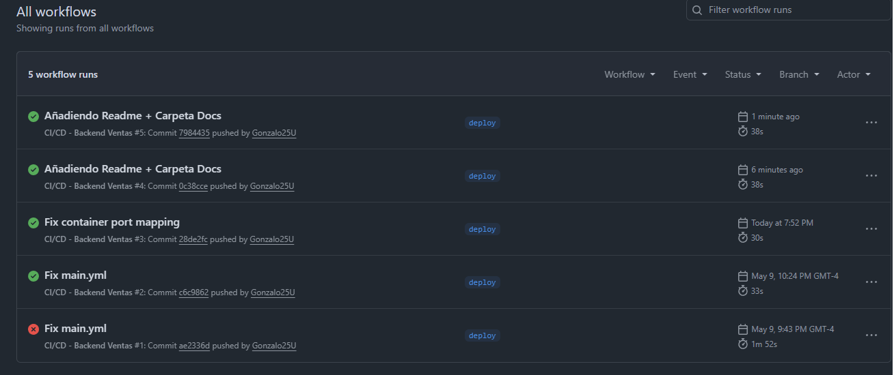
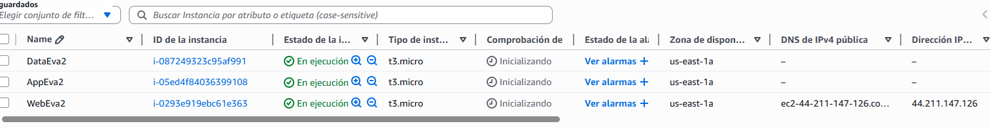

# Backend-ventas-Pipeline-CI-CD-evaluacion-2

Backend de gestión de ventas desarrollado con **Spring Boot 3.4.4** y desplegado mediante un pipeline CI/CD en una instancia EC2 privada de AWS.

---


## 📸 Pipeline en funcionamiento



## 🌐 Frontend desplegado en AWS



---

## 🛠️ Tecnologías utilizadas

- Java 17
- Spring Boot 3.4.4
- Spring Data JPA + Hibernate
- MySQL 8.0
- Maven 3.9
- Docker + Docker Compose
- GitHub Actions (CI/CD)
- AWS EC2

---

## 📁 Estructura de archivos Docker

```
Backend-ventas-Pipeline-CI-CD-evaluacion-2/
├── Springboot-API-REST/
│   ├── src/
│   ├── pom.xml
│   └── ...
├── docker-compose.yml
└── .github/
    └── workflows/
        └── ci-cd.yml
```

> **Nota:** el `Dockerfile` se encuentra dentro de la carpeta `Springboot-API-REST/` junto al código fuente.

---

## 🐳 Dockerfile

Se utilizó un **multi-stage build** con dos etapas:

1. **Stage 1 - Build:** usa la imagen `maven:3.9-eclipse-temurin-17` para compilar el proyecto. El `pom.xml` se copia primero para aprovechar la caché de dependencias de Docker — si el `pom.xml` no cambia, Maven no vuelve a descargar dependencias en el siguiente build.

2. **Stage 2 - Runner:** usa solo el JRE (`eclipse-temurin:17-jre-alpine`) en lugar del JDK completo, lo que reduce significativamente el tamaño de la imagen final. Además se crea un usuario no-root por seguridad.

```dockerfile
FROM maven:3.9-eclipse-temurin-17 AS builder
WORKDIR /app
COPY pom.xml .
RUN mvn dependency:go-offline -B
COPY src ./src
RUN mvn package -DskipTests -B

FROM eclipse-temurin:17-jre-alpine
WORKDIR /app
RUN addgroup -S appgroup && adduser -S appuser -G appgroup
USER appuser
COPY --from=builder /app/target/Springboot-API-REST-0.0.1-SNAPSHOT.jar app.jar
EXPOSE 8080
ENTRYPOINT ["java", "-jar", "app.jar"]
```

---

## 🐙 docker-compose.yml

Se definió un servicio `backend-ventas` con:
- Imagen publicada en Docker Hub: `gonzalo25u/backend-ventas:latest`
- Puerto `8081:8080` (el host expone el 8081, Tomcat corre internamente en el 8080)
- Variables de entorno para conexión a MySQL en EC2 `data`
- **Named volume** para logs persistentes: `ventas_logs:/app/logs`
- IP por defecto de EC2 `data`: `10.0.152.195`

### Justificación del volumen

Se eligió **named volume** sobre bind mount porque:
- Docker gestiona la ubicación automáticamente sin depender de rutas del host
- Es más portable entre distintos sistemas operativos
- El ciclo de vida del volumen es independiente del contenedor

---

## 🔄 Pipeline CI/CD

El pipeline se activa con cada push a la rama `deploy` y tiene dos jobs:

### Job 1: Build & Push
1. Checkout del código
2. Login a Docker Hub con secrets
3. Configuración de Docker Buildx con caché de GitHub Actions
4. Build desde la subcarpeta `./Springboot-API-REST` y push con dos tags:
   - `:latest` → siempre apunta a la versión más reciente
   - `:<sha-commit>` → permite rollback a una versión específica

### Job 2: Deploy en EC2 app (subred privada)
La EC2 `app` no tiene acceso SSH directo desde internet. Se utiliza la EC2 `web` como **jump host (bastion)**:

1. Configuración de llave SSH
2. Creación del directorio destino en EC2 `app` via jump host
3. Copia del `docker-compose.yml` a EC2 `app` via `scp` con ProxyJump
4. Conexión SSH a EC2 `app` via ProxyJump y ejecución del deploy

---

## 🔐 Secrets configurados en GitHub

| Secret | Descripción |
|---|---|
| `DOCKERHUB_USERNAME` | Usuario de Docker Hub |
| `DOCKERHUB_TOKEN` | Token de acceso Docker Hub |
| `EC2_SSH_KEY` | Llave privada SSH (.pem) |
| `EC2_USER` | Usuario de la EC2 (`ec2-user`) |
| `EC2_WEB_HOST` | IP pública de EC2 web (jump host) |
| `EC2_APP_HOST` | IP privada de EC2 app (`10.0.134.191`) |
| `DB_ENDPOINT` | IP privada de EC2 data (`10.0.152.195`) |
| `DB_PORT` | Puerto MySQL (`3306`) |
| `DB_NAME` | Nombre de la base de datos |
| `DB_USERNAME` | Usuario MySQL |
| `DB_PASSWORD` | Password MySQL |

---

## ⚠️ Problemas encontrados y soluciones

### 1. Código fuente en subcarpeta
**Problema:** el código fuente del proyecto está dentro de la subcarpeta `Springboot-API-REST/` y no en la raíz del repositorio, por lo que el pipeline no encontraba el `Dockerfile` ni el `pom.xml`.

**Solución:** se configuró el `context` del build en el `ci-cd.yml` para apuntar a la subcarpeta `./Springboot-API-REST`, y se ajustó la ruta del `docker-compose.yml` en el paso de copia SCP.

---

### 2. Puerto incorrecto en docker-compose
**Problema:** el `docker-compose.yml` mapeaba el puerto `8081:8081`, pero Tomcat dentro del contenedor corre en el puerto `8080` (puerto por defecto de Spring Boot). Esto causaba que el contenedor no respondiera en el puerto 8081 del host.

**Solución:** se corrigió el mapeo a `8081:8080` — el host expone el 8081 y lo redirige al 8080 interno del contenedor.

---

### 3. Error de autenticación MySQL (Public Key Retrieval)
**Problema:** al conectarse a MySQL 8.0, Spring Boot lanzaba el error `Public Key Retrieval is not allowed`. Esto ocurre porque MySQL 8.0 usa por defecto el plugin de autenticación `caching_sha2_password`, que requiere intercambio de clave pública en la primera conexión.

**Solución:** se cambió el método de autenticación del usuario MySQL a `mysql_native_password`:
```sql
ALTER USER 'citt_user'@'%' IDENTIFIED WITH mysql_native_password BY 'Citt5678!';
FLUSH PRIVILEGES;
```

---

### 4. Directorio destino inexistente en EC2
**Problema:** el paso de `scp` en el pipeline fallaba porque el directorio `/home/ec2-user/backend-ventas/` no existía en la EC2 `app`.

**Solución:** se agregó un paso previo en el pipeline que crea el directorio con `mkdir -p` antes de copiar el archivo.

---

### 5. Error de verificación de host SSH
**Problema:** el pipeline fallaba con `Host key verification failed` al intentar conectarse via jump host porque GitHub Actions no tenía el host en `known_hosts`.

**Solución:** se agregó `StrictHostKeyChecking=no` a los comandos `ssh` y `scp` del pipeline.

---

### 6. Security Group sin puertos de backend abiertos
**Problema:** la EC2 `web` no podía alcanzar los backends en EC2 `app` porque el Security Group de `app` no tenía los puertos 8080 y 8081 abiertos desde el Security Group de `web`.

**Solución:** se agregaron reglas de entrada en el Security Group de `app` para los puertos 8080 y 8081 con origen en el Security Group de `web`.

---

## 🚀 Instrucciones para ejecutar localmente

```bash
# Clonar el repositorio
git clone https://github.com/gonzalo25u/Backend-ventas-Pipeline-CI-CD-evaluacion-2-.git

# Entrar a la carpeta del proyecto
cd Springboot-API-REST

# Configurar variables de entorno
export DB_ENDPOINT=localhost
export DB_PORT=3306
export DB_NAME=citt_db
export DB_USERNAME=citt_user
export DB_PASSWORD=Citt5678!

# Ejecutar con Maven
./mvnw spring-boot:run

# O construir imagen Docker desde la raíz del repo
docker-compose up -d --build
```